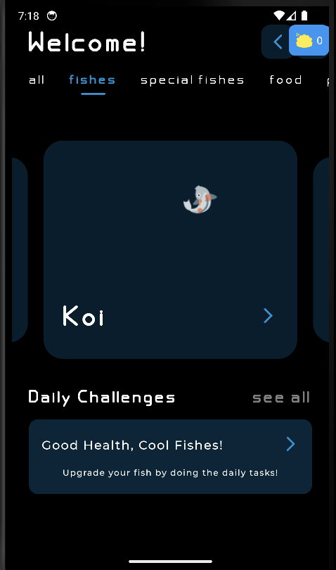

# Google Ignite Team 2 - Healthy Fish App

Welcome to the Google Ignite Team 2's project, where we present the **Healthy Fish App** – a fun and interactive way to promote good health and well-being, aligning with the UN Sustainable Development Goal 3.

## Introduction

In our app, you embark on a journey to improve your health while caring for your virtual fish. The core concept revolves around completing daily challenges to earn valuable "seashells," which can be used to upgrade and 'evolve' your fish into stronger and rarer species. Every player starts with a humble blue basic fish, and the goal is to nurture it into a magnificent, unique creature. 

## Features

-   **Daily Challenges:** Engage in a variety of short, scientifically proven tasks that enhance your health and well-being. Examples include staying hydrated by drinking sufficient water and practicing meditation for mental clarity.

-   **Fish Evolution:** Use the seashells you earn to unlock exciting upgrades for your fish. Watch as it transforms into increasingly rare and powerful forms, reflecting your progress in real-life health improvements.

## How to Get Started

1. Clone this repository to your local machine.
2. Install the Healthy Fish App on your mobile device.
3. Complete daily challenges and earn seashells to evolve your fish.
4. Track your progress and witness your fish's transformation.

## Join Us

We invite you to join us on this exciting adventure towards better health and cooler fish! Feel free to contribute to the project, share your ideas, or report any issues you encounter.

## Attribution

-   **Free Stock Photos:** We thank [Vecteezy](https://www.vecteezy.com/free-photos) for providing the free stock photos used in our project.

Get started now, and let's make healthy living fun with our Healthy Fish App!
